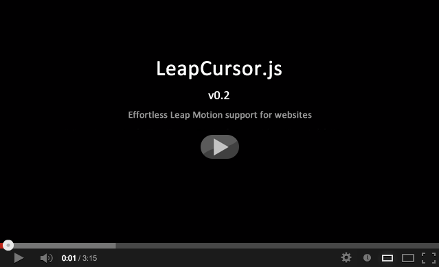
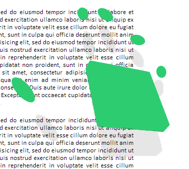

# LeapCursor.js v0.2

This library provides Leap Motion support for websites with just a single line of code.  

**v0.2 release: Now supports mouseenter, mouuseleave, and click events out of the box**.  

When users with a Leap Motion load a page that includes LeapCursor.js they're presented with a hand in the corner of the screen.  

(This is just the default - color, size, and placement can all be customized.)

When the user moves a hand over the Leap, the hand on screen moves to follow, matching position, rotation and finger movement, and allowing the user to interact with the page.  

Default interactions are scrolling around the page, generating *mouseenter* and *mouseleave* events, and generating *click* events. 

Mouse enter and leave events are generated when the cursor moves over a page element. Clicks are generated when the user makes a tapping motion.

New gestures can be added to LeapCursor using [LeapTrainer.js](https://github.com/roboleary/LeapTrainer.js), which is included as a dependency of the library, [as described below](#adding-new-gestures).

Below is [a video of v0.2 of the library in action](http://youtu.be/urjzNBUYC8Q).  The original [v0.1 video can be found right here](http://youtu.be/trZy-A8Y1-k). 

An online demo [can be found right here](https://rawgithub.com/roboleary/LeapCursor.js/master/demo.html).

## Table of contents

* [Usage](#usage)
* [Options](#options)
* [Adding new gestures](#adding-new-gestures)
* [Alternatives](#alternatives)
* [Release Notes](#release-notes)
* [Thanks](#thanks)
* [Author](#author)
* [Version](#version)
* [License](#license)

## Usage

The easiest way to use LeapCursor is to just include it in your page:

	

The hand will now appear for Leap users when the page loads, and the window will scroll as the hand moves.

To detect when the cursor fires an event associated with a page element, normal event listeners can be used.  For example, using jQuery:

	$(elm).click(function() { alert('Leap cursor click!'); });

The above include bundles the library dependencies - which are:

* [Leap.js](http://js.leapmotion.com/)
* [LeapTrainer.js](https://github.com/roboleary/LeapTrainer.js)
* [Three.js](http://threejs.org/)
* [Detector.js](https://github.com/mrdoob/three.js/blob/master/examples/js/Detector.js)

If you don't want these bundled inside LeapCursor you can include them separately:

	
	
	
	
	

## Options

Options can be passed to LeapCursor on the script URL.  For example, including the script like this:

	

Will result in a giant hand like this:

The following options are available. 

* **color** : A hex color code for the hand (default: #000000).

* **top** : The resting y-coordinate of the hand - where it goes when not in use  (default: The window height minus the hand height, recalculated when the window is resized) 

* **left**: The resting x-coordinate of the hand (default: The window width minus the hand width, recalculated when the window is resized)

* **width**: The width of the hand in pixels (default: 110)

* **height**: The height of the hand in pixels (default: 110)

* **scrollSpeed**: How fast the target will scroll in response to hand movement - higher is faster. (default: 0.1)
 
* **dampening**: How quickly the scroll will slow down and stop when the hand moves out of sight (default: 0.95)

* **gestureColor**: The color the hand is set to when a gesture is being recorded(default: #88CFEB)

## Adding new gestures

[LeapTrainer.js](https://github.com/roboleary/LeapTrainer.js) is a  gesture recording and recognition framework for the Leap, and is included by default in LeapCursor (*it's used to recognize click motions*).  

Gestures can be recorded using the LeapTrainer UI and then included in other applications.  LeapTrainer gestures can be used with LeapCursor in order to provide new kinds of interactivity with the cursor.

During initialization LeapCursor creates an instance of itself in the window scope called *leapCursor* - this instance can be used to access the LeapTrainer controller for loading gestures and receiving callbacks.  For example:

	$(document).ready(function() {

        //Import a gesture retrieved from the LeapTrainer UI
		leapCursor.trainer.fromJSON('{"name":"LEFT","data":[...]]}');

        //Attach an event listener for the imported gesture
		leapCursor.trainer.on('LEFT', function() { alert('Go left!'); });
	});

This example uses jQuery for the sake of brevity - for the same code without any jQuery dependency [take a look at the source of the demo.html](https://raw.github.com/roboleary/LeapCursor.js/master/demo.html)

When LeapTrainer is recording, LeapCursor updates the color of the hand.  The recording color can be set using the *gestureColor* option described above.

## Alternatives

A reasonable alternative would be one of the systems that provide OS-level support for Leap Motion input. An advantage  of this approach is that you have a standard set of motions for all applications.  However, a disadvantage is that it takes the design of motion interactivity out of the hands of content developers and centralizes it around one approach.

If website and web application developers design how motion and gesture interation work on the web, we have a model in which solutions compete and the best approaches can evolve. 

Also, when motion support is implemented on the web-side, applications can connect specific features of their web applications to their choice of movements and gestures - which helps open up the endless possibilities for expressiveness in motion input.

##Release Notes

**v0.2**

* [LeapTrainer.js](https://github.com/roboleary/LeapTrainer.js) now included by default
* Added click, mouseenter and mouseleave events

**v0.1**

* Window scroll support
* Cursor rendering
* Options parsing

## Thanks

As with LeapTrainer, the original code used to render a 3D hand on screen was based on code from jestPlay, by Theo Armour, [which you can find right here](http://jaanga.github.io/gestification/).  Thanks Theo!

## Author

Robert O'Leary

Contact: robertjoleary AT gmail DOT com

## Version

0.2

## License

Copyright (c) 2013 Robert O'Leary

Licensed under [MIT](http://www.opensource.org/licenses/mit-license.php). Go nuts.

